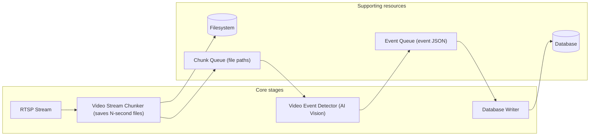
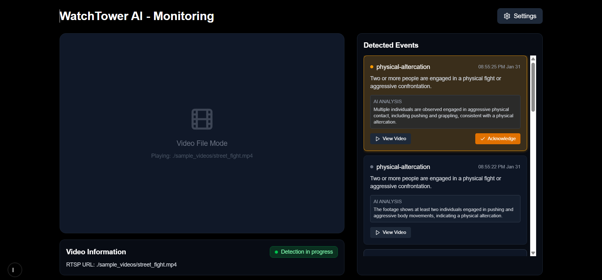
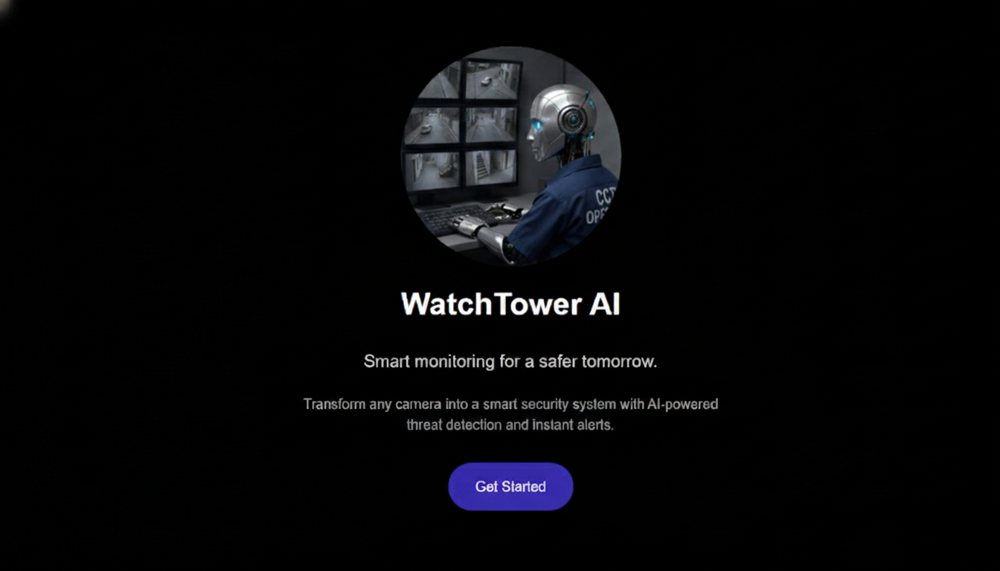
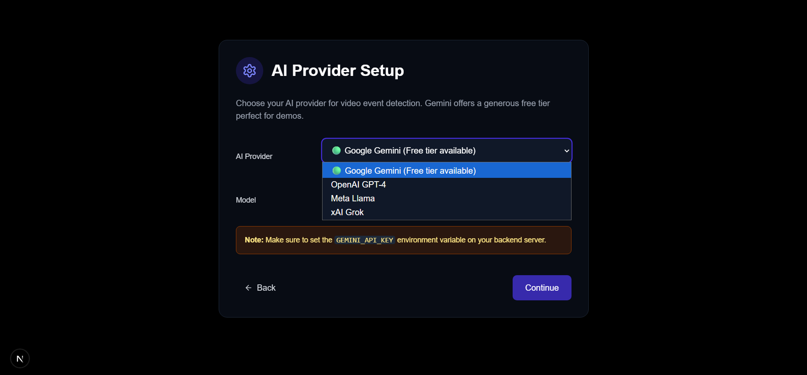
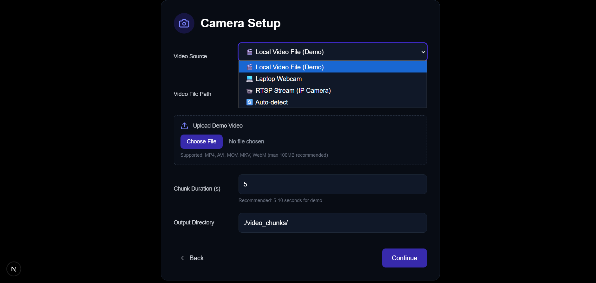
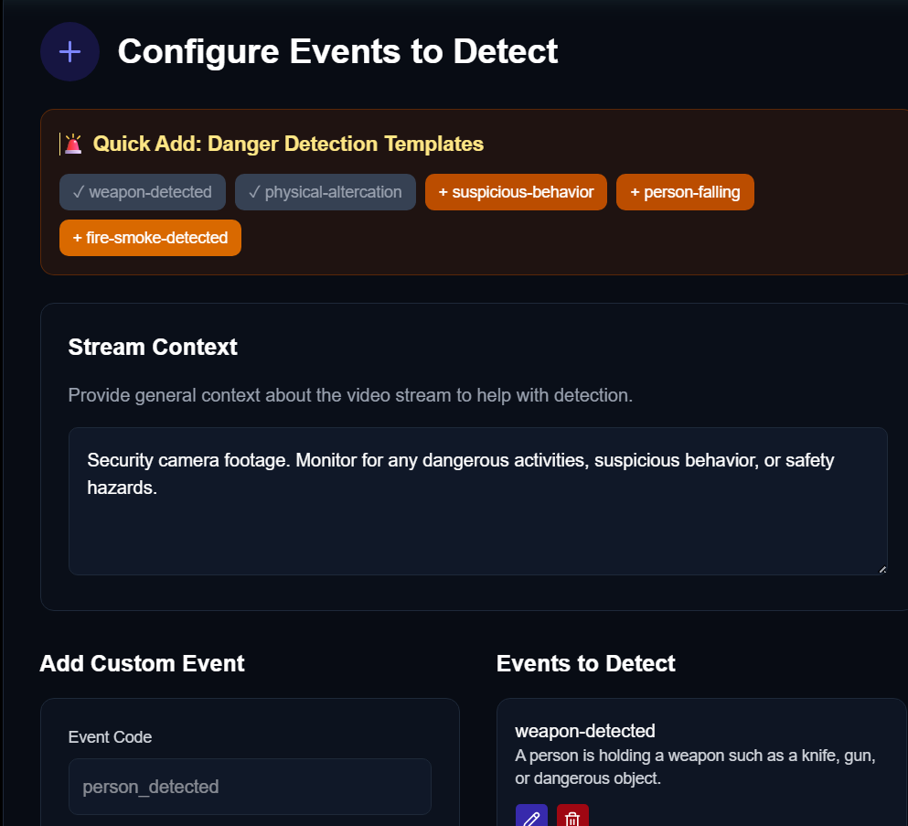

# GitHub Repository Requirements

## Problem Statement
Manual CCTV monitoring is inefficient, error-prone, and cannot scale to modern security needs. Security teams struggle to detect complex, high-level events (like fights, loitering, or trespassing) in real time, and reviewing hours of footage is slow and costly. WatchTower AI solves this by automating continuous CCTV monitoring using advanced vision–language models, enabling natural-language event definitions, real-time alerts, and comprehensive event logging—all without custom model training or hardware changes.

## Solution Overview
🎥 Demo / Walkthrough Video:
https://youtu.be/-s9XeL6KFlc?si=BC0jZWuGPYnKNxqm

WatchTower AI is a web-based, intelligent CCTV monitoring system designed to automate security surveillance using modern vision–language AI models. It transforms traditional camera feeds into an active monitoring solution by understanding video content in context, detecting complex security events in near real time, and alerting users instantly—without requiring any custom model training or changes to existing CCTV infrastructure.

Key capabilities of the solution include:

Connects to live CCTV feeds or video files
Works seamlessly with RTSP camera streams as well as pre-recorded video inputs—no hardware changes required.

Define security events using natural language
Users can describe events like “detect fights,” “identify loitering,” or “flag trespassing” in plain English—no coding or AI expertise needed.

Near real-time video analysis
Live video is divided into short segments and analyzed continuously to ensure fast and responsive event detection.

Powered by vision–language AI models
Utilizes advanced models such as Gemini, Llama, OpenAI Vision, Claude, and ChatGPT to understand both visual scenes and textual event descriptions.

No model retraining required
New detection rules can be added or modified instantly through prompts, making the system highly flexible and adaptable.

Live monitoring dashboard
Provides a centralized interface to view camera feeds, detected events, and detailed event logs in real time.

Instant alerts on critical events
Sends real-time notifications when a defined security event occurs, enabling quicker response and intervention.

Event logging & video evidence storage
Automatically stores event metadata and related video clips for audits, investigations, and future analysis.

Modular and scalable architecture
Built to scale across multiple cameras and locations while integrating smoothly with existing CCTV systems.

## 🏗️ Simple Architecture Diagram


## 🛠️ Tech Stack
- **Backend:** Python (FastAPI), Gemini, Llama, OpenAI Vision, Claude, ChatGPT
- **Frontend:** Next.js (React)
- **Database:** SQLite (default, can be swapped for PostgreSQL)
- **Other:** PowerShell scripts for service management, Docker (optional)

## ⚙️ Setup Instructions
### Backend
1. Install Python 3.10+ and pip.
2. Navigate to the `backend` folder:
   ```sh
   cd backend
   pip install -r requirements.txt
   ```
3. Copy `.env.example` to `.env` and set your API keys (Gemini, OpenAI, Llama, Claude, etc.).
4. Start the backend server:
   ```sh
   uvicorn app:app --reload
   ```

### Frontend
1. Install Node.js (18+ recommended) and npm.
2. Navigate to the `frontend` folder:
   ```sh
   cd frontend
   npm install
   npm run build
   npm run dev
   ```
3. Open [http://localhost:3000](http://localhost:3000) in your browser.

## 🤖 AI Tools Used
- **Gemini** (Google): Vision–language model for event detection
- **Llama** (Meta): Vision–language model for event detection
- **OpenAI Vision**: Multimodal event detection
- **Claude** (Anthropic): Vision–language model (if available)
- **ChatGPT** (OpenAI): For prompt engineering, event template generation, and optionally as a vision model

## 📝 Prompt Strategy Summary
- Users define events using natural-language descriptions (e.g., "Detect if two or more people are fighting").
- These descriptions are sent as prompts to the selected vision–language model (Gemini, Llama, OpenAI Vision, Claude, or ChatGPT).
- The model analyzes each video chunk and returns a detection result (event present/not present, explanation, etc.).
- No model retraining is required—new events can be added or changed instantly.

## 📦 Source Code
All source code is included in this repository under the `backend` and `frontend` folders.

## 🏁 Final Output
- Live dashboard for video monitoring and event detection
- Real-time event alerts and logs
- Event metadata and video clips stored for review
- Example dashboard screenshot:
  

## 🔁 Build Reproducibility Instructions (Mandatory)
1. Clone this repository:
   ```sh
   git clone <your-repo-url>
   cd <repo-folder>
   ```
2. Follow the setup instructions above for backend and frontend.
3. Ensure you have valid API keys for at least one supported AI provider (Gemini, OpenAI, Llama, Claude, or ChatGPT).
4. Start both backend and frontend services (see PowerShell scripts or manual commands).
5. Open [http://localhost:3000](http://localhost:3000) and verify the dashboard loads, video plays, and events are detected.

---


# WatchTower AI – Next-Gen CCTV Monitoring

WatchTower AI is an advanced, AI-powered CCTV monitoring system designed to automate and enhance security operations across a wide range of environments. Built for flexibility, scalability, and real-world impact, it reduces human workload, improves incident response, and adapts to your unique security needs—without requiring any custom model training.

## 🚀 Key Features & Benefits

- **Reduces human workload:** Automates continuous CCTV monitoring, so human operators don’t need to watch screens 24/7.
- **Detects complex, high-level events:** Can identify situations like suspicious behavior, loitering, fights, trespassing—not just objects.
- **No model training required:** New events can be added using natural-language descriptions, without retraining AI models.
- **Faster incident response:** Real-time alerts allow security teams to act immediately instead of reviewing footage later.
- **Lower deployment cost:** Avoids expensive custom computer-vision training pipelines and specialized datasets.
- **Highly flexible and configurable:** Security teams can redefine “what is dangerous” based on context (location, time, rules).
- **Scales easily:** Can monitor many camera feeds simultaneously with minimal human supervision.
- **Improves accuracy over rule-based systems:** Context-aware AI reduces false positives compared to simple motion or object detection.
- **Event logging & audit trail:** All detected events are stored, helping in investigations, reporting, and compliance.
- **Works with existing CCTV infrastructure:** Uses standard RTSP camera streams—no hardware replacement needed.

## 🎯 Usage / Applications

- **Public safety & city surveillance:** Monitor streets, stations, airports, and public areas for violent or suspicious activities.
- **Campus & school security:** Detect unauthorized entry, fights, or unsafe behavior in hostels and academic buildings.
- **Corporate offices & IT parks:** Identify restricted-area violations, after-hours presence, or unusual behavior.
- **Retail & shopping malls:** Prevent theft, vandalism, or detect crowd congestion and emergencies.
- **Factories & industrial sites:** Detect safety violations, unauthorized access, or dangerous movements near machinery.
- **Hospitals:** Monitor sensitive areas, detect patient falls, or unauthorized access to restricted zones.
- **Residential societies:** Enhance gate security, detect suspicious loitering, or track entry/exit anomalies.
- **Event venues & stadiums:** Crowd behavior monitoring, detecting fights, stampede risks, or emergencies.
- **Smart city platforms:** Integrates into larger smart-city dashboards for automated urban monitoring.
- **Law enforcement support:** Helps police filter hours of footage by highlighting only meaningful incidents.

## 🛠️ Technology Stack

- **Backend:** Python (FastAPI), Gemini / Llama / OpenAI Vision
- **Frontend:** Next.js (React)
  
---

For more details, see the backend and frontend README files, or contact the project maintainers.


## Application UI

Here's a walkthrough of the user interface:

1.  **Welcome Screen:** The application greets the user and explains its purpose.
  

2.  **AI & Model Selection:** Choose which AI provider's API you want to use (e.g., Gemini, Llama, OpenAI) and select the specific model for event detection.
  

3.  **Camera Setup:** Configure your camera or video stream source. This step allows you to set up RTSP or file-based video feeds for monitoring.
  

4.  **Custom Event/Template Addition:** Add any custom event or detection template using natural language. You can define new events or modify existing ones without retraining the AI.
  

5.  **Detected Events Dashboard:** View all detected events in real time, including event details, timestamps, and associated video clips.
  